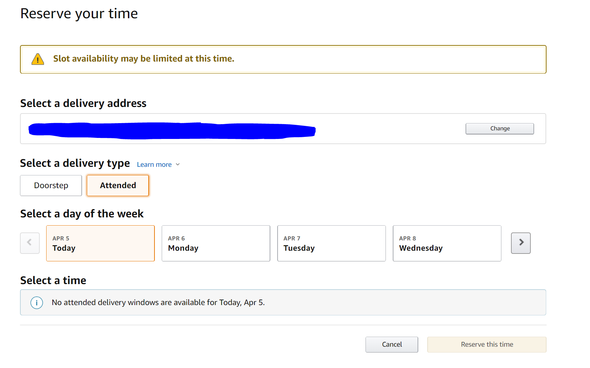

# Amazon Fresh Delivery Slot Alert

This repo uses [Python](https://www.python.org/) and [Selenium](https://www.selenium.dev/) to automatically check when delivery slots are available for particular dates. It is just a python script running in your local, so no need to worry about any privacy issues. You need to have a link to your Amazon Fresh reserve time page as shown below and specify some dates to check (see Instructions below). The scripts will automatically check and email alerts when there are slots available. 



# Installation and Setup

1. Install Python: https://www.python.org/downloads/
2. Install pytest: 
```sh
pip install pytest
```
3. Install ygmail
```sh
pip install ygmail
```
4. Install numpy
```sh
pip install numpy
```
5. Install Python bindings for Selenium: https://selenium-python.readthedocs.io/installation.html

# Instructions

You need to open "test_amazonFresh.py" and set the following parameters at the beginning of the file:

* EMAIL_SENDER: A Gmail address from which the alert will send from. You might need to enable less secure app access, https://myaccount.google.com/lesssecureapps?pli=1, to send emails from your local script.

* PASSWORD_SENDER: Password for "EMAIL_SENDER"

* CHROME_PROFILE_PATH: Path to your Chrome default profile, e.g., C:\Users\username\AppData\Local\Google\Chrome\User Data. Note that you need to make sure your default chrome profile is able to directly load your "reserve time" page without asking to input amazon user and password. 

* CHROME_DRIVER_PATH: where your chromedriver is located e.g., C:\Users\username\Tools\chromedriver.exe. (Download from 5. Install Python bindings for Selenium: https://selenium-python.readthedocs.io/installation.html)

* EMAILS: A list of emails addresses to receive the alert e.g, ['abc.gmail.com', 'xyz.gmail.com']. You can also include email addresses of your friends who have similar zip codes.

* AMZ_FRESH_SELECT_TIME_PAGE_LINK: The weblink for your Amazon Fresh reserve time page as shown above.

* DATES = ['2020-04-06', '2020-04-07']: Valid Dates you want to check.

# Time to RUN
Start the script:
```sh
pytest test_amazonFresh.py
```
The script will keep running until you stopped it. For the default settings, it will check every 1~5 mins. For each check, it will switch dates every 1~5 seconds. When there are time slots show up in the reserve page (regardless of whether they are grey or not), the script will create the email alerts and stopped at the page with the time slots.
